# Project Lair — 역방향 보스전 로그라이크

*당신이 보스다. 5분 안에 쳐들어온 용사를 막아라 — 자동전투 로그라이크 + 덱빌딩.*

> 🎯 **개인 프로젝트** · 코드네임 **Project Lair** (출시명 TBD) · Unity 6 · 2.5D 탑다운 · 싱글플레이>
> 🎮 **한 줄 컨셉** · 플레이어는 던전 주인. 직접 싸우지 않고 **카드로 던전을 운영**해 자동으로 쳐들어오는 용사를 5분 안에 처치
>
> 🧱 **설계 키워드** · 단일 오케스트레이터 + 서비스 분리 · 인터페이스 seam 으로 의존성 역전 · 데이터 주도(ScriptableObject + JSON) · MVVM · 재사용 가능한 인프라 패키지(단방향 의존) · 테스트 우선

[]()
[]()
[]()
[]()
[]()
[]()
[-EAB308)]()
[]()

### 📦 다운로드

[](https://github.com/chvj7567/Project_Lair/releases/latest/download/Project_Lair.apk)

> 👆 **위 뱃지를 클릭하면 최신 버전 Android APK 가 바로 다운로드됩니다.** 전체 릴리스 목록은 [Releases](https://github.com/chvj7567/Project_Lair/releases) 페이지 참조.

### ▶️ 전체 플레이 영상

[](https://youtu.be/2u4zlQNH_os)

> 👆 **위 썸네일을 클릭하면 YouTube 로 이동해 전체 플레이 영상을 볼 수 있습니다.**
>
> 5분 한 판 풀 플레이 — 좌상단 4축 빌드 카운터(TANK/DPS/DEBUFF/SWARM), 상단 타이머 + 영웅 HP 바, 자동 교전과 사방에서 수렴하는 몬스터 무리, HP%·시간마다 끼어드는 3택 1 카드픽.

---

## 🎮 어떤 게임인가

대부분의 던전 게임에서 플레이어는 **쳐들어가는 용사**입니다. Project Lair 는 그 시점을 뒤집습니다 — **플레이어가 던전의 주인이고, 용사는 AI 가 조종하는 침입자**입니다.

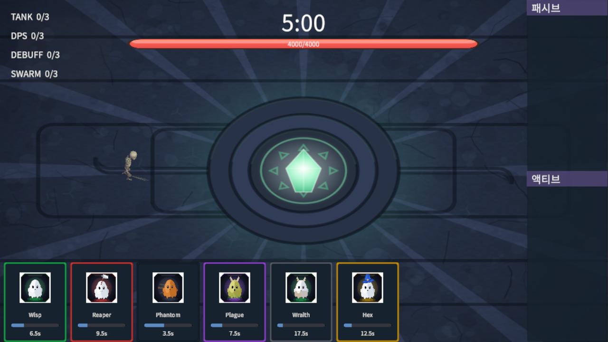

- **플레이어는 직접 싸우지 않는다.** 용사 한 명이 던전 정중앙에 등장해 자동으로 전투를 시작하고, 플레이어가 운영하는 몬스터 무리가 자동으로 맞섭니다. 플레이어의 역할은 *전투*가 아니라 *던전 경영*입니다.
- **5분, 그리고 끊임없는 선택.** 용사 HP 가 10% 깎일 때마다 **패시브 카드 3택 1**(최대 9회), 60초마다 **액티브 카드 3택 1**(30초에 첫 발동, 한 판 5회). 한 판에 최대 14번 — 평균 약 20초마다 한 번씩 의사결정이 들어옵니다. 짧지만 밀도 높은 빌드업.
- **카드의 무게중심은 "던전을 영구히 바꾸는 결정".** 몬스터를 강화하고, 스폰 라인을 늘리고, 종을 바꾸고, 용사에게 저주를 건다 — 한 번의 픽이 남은 판 전체의 생산 라인을 바꿉니다. 여기에 광폭화·암흑의 가호처럼 짧게 터뜨리는 일시 버프 카드가 섞여, 영구 빌드 위에 순간의 변수를 얹습니다. 그래서 매 선택이 빌드를 쌓는 감각으로 이어집니다.
- **용사는 점점 강해진다.** HP 가 일정 단계(85/65/45%)를 지날 때마다 용사가 돌진 강타 → 광역 노바 → 궤도 블레이드를 차례로 해금하고, 그때마다 **시간이 멎고 카메라가 흔들리는 격겜식 컷인 배너**가 "영웅의 '○○' 스킬 해제"를 알립니다. 막판은 "보스(던전)가 용사를 끝내는가, 용사가 발악으로 뚫는가"의 클라이맥스가 되도록 설계했습니다.

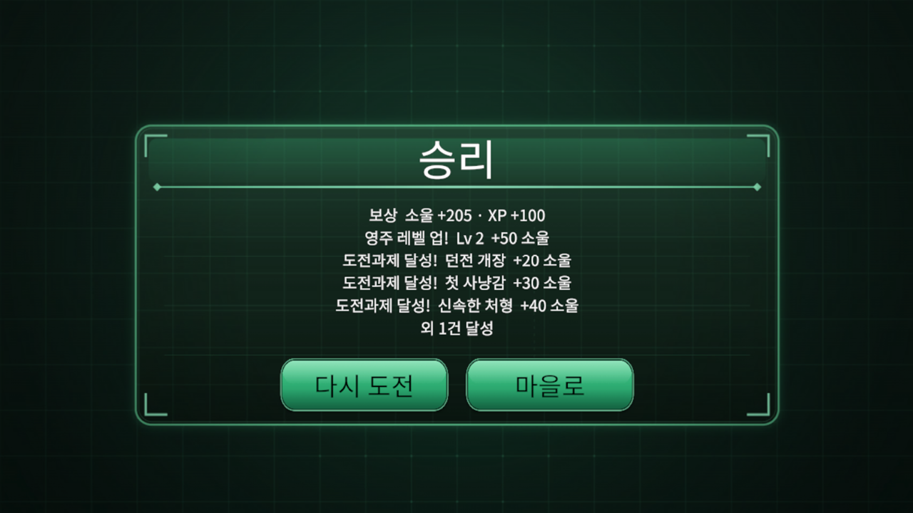

> **디자인 가설 — 단계별로 검증:** MVP 는 *"5분 자동전투 + HP%/시간 트리거 선택지가 재미있는가"* 를 검증했고, **v0.2 는 *"마을 허브 + 메타 성장이 재방문 동기를 만드는가"***, **v0.3 은 *"클라우드 계정·세이브·랭킹이 재방문·경쟁 동기를 강화하는가"*** 로 가설을 확장했습니다. 각 단계는 앞 가설을 검증한 뒤에만 다음 범위를 열었습니다(의도적 범위 제한). 구글 로그인·계정 연동과 새 영웅·몬스터·카드 *리소스* 제작은 다음 단계로 미뤄, 지금은 기존 에셋을 재스킨/재활용하는 선에서 메타를 얹었습니다.

| 비교 | Legend of Keepers | Dungeon Keeper | **Project Lair** |
|---|---|---|---|
| 전투 | 턴제 | RTS | **자동 (뱀서식)** |
| 런 길이 | 30분+ | 시간 단위 | **5분** |
| 침입자 | 파티 | 무리 | **솔로 용사 (보스급 AI)** |
| 빌드업 | 함정 업그레이드 | 영토 확장 | **HP%/시간 트리거 카드픽 + 4축 시너지** |

---

## 🧩 한눈에 보는 구조

게임 한 판은 **하나의 오케스트레이터(`BattleController`)가 작은 서비스·시스템들을 조립**하는 형태로 돌아갑니다. 트리거가 "언제 고를지"를 정하고, 플레이어의 픽이 데이터(카드)로 표현된 효과가 되어, 인터페이스 seam 을 통해서만 전투에 개입합니다.

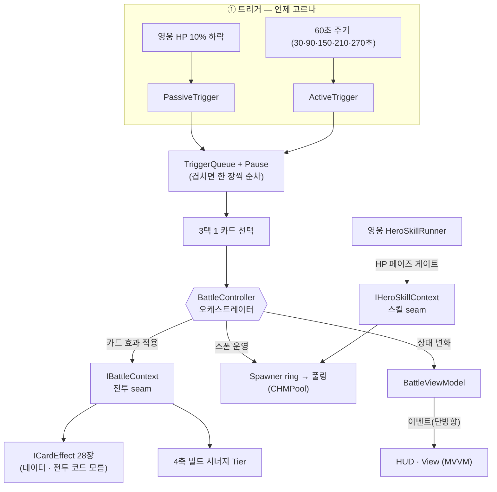
```mermaid
flowchart TB
    subgraph TRIG["① 트리거 — 언제 고르나"]
      HP["영웅 HP 10% 하락"] --> PT[PassiveTrigger]
      T30["60초 주기 (30·90·150·210·270초)"] --> AT[ActiveTrigger]
    end
    PT & AT --> Q["TriggerQueue + Pause<br/>(겹치면 한 장씩 순차)"]
    Q --> PICK["3택 1 카드 선택"]

    PICK --> BC{{"BattleController<br/>오케스트레이터"}}
    BC -->|"카드 효과 적용"| CTX["IBattleContext<br/>전투 seam"]
    CTX --> EFF["ICardEffect 28장<br/>(데이터 · 전투 코드 모름)"]
    CTX --> SYN["4축 빌드 시너지 Tier"]

    BC -->|"스폰 운영"| SPW["Spawner ring → 풀링(CHMPool)"]
    BC -->|"상태 변화"| VM["BattleViewModel"]
    VM -->|"이벤트(단방향)"| VIEW["HUD · View (MVVM)"]

    HERO["영웅 HeroSkillRunner"] -->|"HP 페이즈 게이트"| HCTX["IHeroSkillContext<br/>스킬 seam"]
    HCTX --> SPW
```

### 설계 원칙 — 왜 이렇게 짰는가

| 원칙 | 무엇을 | 왜 (포트폴리오 관점) |
|---|---|---|
| **오케스트레이터 + 서비스 분리** | 라이프사이클은 `BattleController` 하나가 조율하고, 트리거·일시정지·큐·몬스터 버프·시너지 등은 각각 작은 POCO 서비스로 분리 | 로직이 한 거대 클래스에 뭉치지 않음. 각 규칙을 독립적으로 이해·교체·테스트 |
| **인터페이스 seam 으로 의존성 역전** | 카드 효과는 `IBattleContext` 만, 영웅 스킬은 `IHeroSkillContext` 만 본다. 구체 전투 클래스를 전혀 모름 | ① 콘텐츠(카드/스킬)가 엔진 코드에 안 묶임 ② 가짜(fake) 컨텍스트로 "무엇을 했는가"를 Unity 없이 단위 테스트 |
| **데이터 주도** | 카드·밸런스·영웅 스킬을 ScriptableObject 로, 카드 효과를 다형 직렬화로 저장. JSON 과 양방향 동기화 | 밸런싱·카드 추가가 코드 재컴파일 없이 데이터 편집으로 끝남 |
| **MVVM 단방향** | 전투 상태(Model) → 가공(ViewModel) → 표시(View) 한 방향. ViewModel 은 화면을 모름 | 화면을 바꿔도 전투 로직이 안 흔들리고, ViewModel 단위 테스트 가능 |
| **인프라 단방향 의존** | 게임 코드 → 공용 인프라 패키지(ChvjPackage) → Unity. 역참조 금지 | 리소스 로딩·풀링·UI 가 게임과 분리되어 재사용 가능한 토대 |

---

## ✨ 핵심 시스템 (게임 + 구조)

각 시스템은 **무엇을 위한 것인지(게임)** 와 **어떻게/왜 그렇게 구성했는지(구조)** 로 설명합니다. 코드 디테일은 접은 블록 안에 둡니다.

## 1. ⏱️ 5분 코어 루프

### 1-1. 지속 스폰 — 던전을 "경영"하게 만드는 토대

> **게임:** 몬스터를 시작에 한 번 깔고 끝이 아니라, 던전 둘레의 생산기(Spawner)들이 한 판 내내 몬스터를 흘려보냅니다. 그래서 카드로 "생산 라인을 늘리고/바꾸는" 결정이 의미를 가집니다 — 플레이어는 전투가 아니라 **공장을 경영**하는 감각을 갖습니다.

<details>
<summary>구조 — 어떻게 구성했나</summary>

- **생산기(Spawner)는 "무엇을·얼마 주기로·몇 마리씩" 만 안다.** 실제 스폰은 자기가 하지 않고 호스트(오케스트레이터)에 위임합니다. 덕분에 카드가 출력 종/주기/수를 바꿔도 스폰 경로는 하나로 유지됩니다.
- **카드가 곧 생산 라인 변경.** 추가소환 = 출력 +1, 융합 = 출력 종 영구 변경, 가속 = 주기 단축. 전부 영구 변화라 "빌드를 쌓는" 결정이 됩니다.
- **스폰 통계는 한 군데서 적용.** 몬스터 스탯은 항상 한 메서드를 거치며 종별 누적 강화 배율을 곱합니다 — 같은 종이면 이미 필드에 나와 있는 몬스터에도 소급 적용(현재 HP 보존, 최대치만 상향).

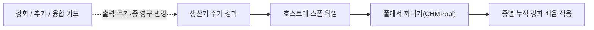
```mermaid
flowchart LR
    Tick["생산기 주기 경과"] --> Host["호스트에 스폰 위임"]
    Host --> Pool["풀에서 꺼내기(CHMPool)"]
    Pool --> Stats["종별 누적 강화 배율 적용"]
    Card["강화 / 추가 / 융합 카드"] -.->|"출력·주기·종 영구 변경"| Tick
```

</details>

### 1-2. 두 개의 시계 — HP 10% / 60초

> **게임:** 빌드업을 두 축으로 분리했습니다. **패시브(HP 10%마다·최대 9회)** 는 "용사가 얼마나 버티느냐"에 연동돼 *던전을 강화*하고, **액티브(60초마다·한 판 5회)** 는 시간에 연동돼 *용사를 저주*하거나 *몬스터를 버프*합니다. 둘이 독립적이라 같은 판이라도 전개가 매번 달라집니다.

<details>
<summary>구조 — 어떻게 구성했나</summary>

- 트리거는 두 개의 작은 서비스로 분리: 하나는 HP 변화를, 하나는 전투 시계를 구독해 임계를 넘는 순간만 신호를 쏩니다. 전투 본체는 "언제"를 신경 쓰지 않습니다.
- 임계값(HP 단계·시간 간격)은 밸런스 데이터에 있어 코드 수정 없이 페이싱을 조정할 수 있습니다.
- 같은 카드를 3번까지만 뽑히게 하는 픽 제한이 카드 풀에서 후보를 거릅니다 — 한 카드 도배 방지.

</details>

### 1-3. 겹침 처리 — 일시정지 + 큐

> **게임:** 패시브와 액티브가 동시에 터져도 선택이 겹쳐 보이지 않습니다. 게임을 멈추고 **한 장씩 또렷하게** 고르게 합니다. 5분의 압박 속에서도 선택만큼은 침착하게.

<details>
<summary>구조 — 어떻게 구성했나</summary>

- 동시에 발생한 트리거는 큐에 쌓이고, 오케스트레이터가 재진입 가드로 **한 번에 하나씩만** 팝업을 띄웁니다(패시브 우선).
- 일시정지는 시간 기반 시계·스폰·버프 타이머를 한꺼번에 자연 정지시킵니다 — 별도 "멈춤 플래그"를 곳곳에 심지 않고, 시간 흐름 하나만 멈추면 전부 멈추도록 설계.
- 팝업은 비동기로 대기 — 플레이어가 한 장을 고를 때까지 다음 처리가 진행되지 않습니다.

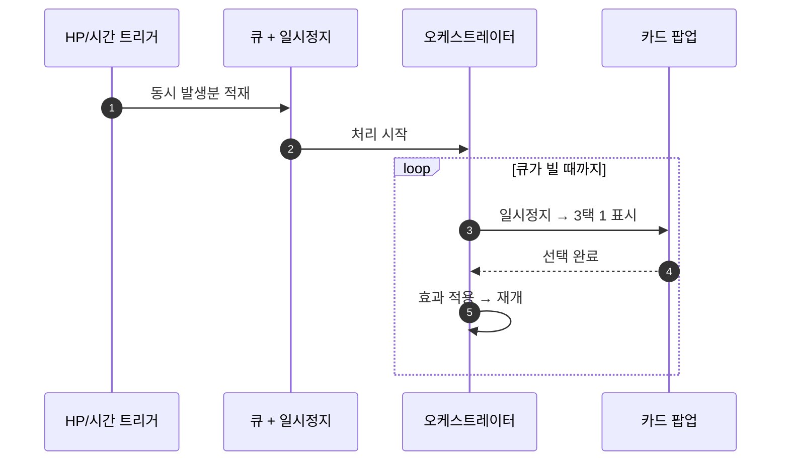
```mermaid
sequenceDiagram
    autonumber
    participant 트리거 as HP/시간 트리거
    participant 큐 as 큐 + 일시정지
    participant 코어 as 오케스트레이터
    participant UI as 카드 팝업
    트리거->>큐: 동시 발생분 적재
    큐->>코어: 처리 시작
    loop 큐가 빌 때까지
        코어->>UI: 일시정지 → 3택 1 표시
        UI-->>코어: 선택 완료
        코어->>코어: 효과 적용 → 재개
    end
```

</details>

---

## 2. 🏘️ 마을 허브 & 메타 성장 (v0.2)

> **게임:** MVP 의 "한 판이 재미있는가"를 검증한 뒤, **"왜 다시 돌아오는가"** 를 물었습니다. 그 답으로 **마을 허브 「영주의 둥지」** 를 넣었습니다 — 별도 메인 메뉴 없이 **마을이 곧 시작 화면**이고, 한 판에서 번 **소울**로 던전을 영구히 키운 뒤 다시 출격합니다. 판 밖에서도 성장이 쌓이는 메타 루프입니다.

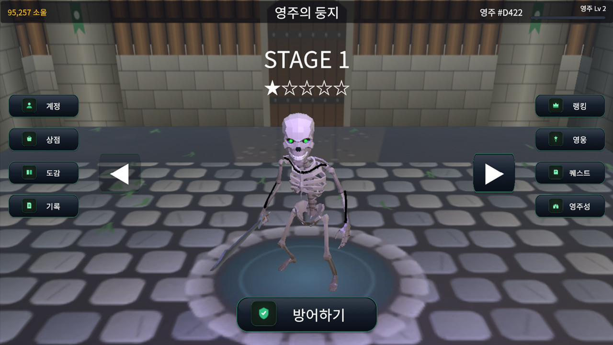

- **스테이지 진행** — 마을 중앙 캐러셀에서 스테이지(1~5)를 골라 출격. 클리어해야 다음 스테이지가 열리고, 마을 진입 시 **플레이 가능한 최고 스테이지**에서 시작합니다.
- **소울 경제** — 승리로 얻은 소울을 상점 강화·영주 레벨에 재투자하는 단일 재화 루프.

### 2-1. ☁️ 클라우드 계정 · 랭킹 — 익명 계정으로 Firebase 에 저장

> **게임:** 마을에서 키운 것이 **기기 안에만 있으면 언젠가 잃습니다.** 그래서 계정·세이브·랭킹을 클라우드로 올렸습니다. **로그인 화면도 가입 절차도 없습니다** — 첫 실행에 익명 계정이 자동으로 생기고, 앱을 껐다 켜도 같은 계정으로 붙습니다. 마을 진행도가 통째로 백업되고, 최단 클리어 기록은 전역 랭킹으로 모여 "지금 몇 등인가"라는 새 목표를 만듭니다.

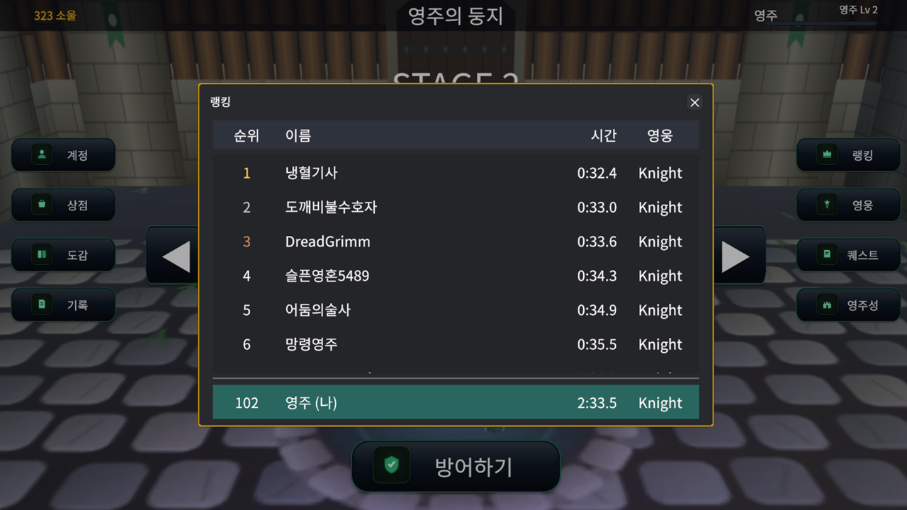

- **익명 인증** — 아무것도 묻지 않고 계정이 생깁니다. 진입 마찰 0
- **표시명 변경** — 마을 ☁️ 계정 메뉴에서 닉네임을 바꿉니다. 중복은 **서버가 권위로 막고**, 이미 올라간 **랭킹 기록의 이름까지 함께 바뀝니다**
- **최단클리어 랭킹** — Top 100 과 내 순위를 함께 조회합니다. **100위 밖이어도 내 등수가 하단에 고정**돼 끝까지 스크롤할 필요가 없습니다

<details>
<summary>구조 — 어떻게 구성했나</summary>

- **백엔드는 인터페이스 뒤에 있다** — 게임 코드는 `ILairApiClient` 7개 메서드만 봅니다. 실제로 이 프로젝트는 백엔드를 **두 번 갈아탔는데**(자체 서버 → Firebase REST → Firebase Unity SDK), 매번 바뀐 것은 **구현체 하나와 조립 한 줄**뿐이었고 UI·서비스·테스트는 그대로였습니다. 추상화가 값을 한 지점입니다.
- **SDK 타입을 컴파일로 가둔다** — 테스트 어셈블리가 Firebase DLL 을 아예 참조하지 않도록 asmdef 를 닫아 두었습니다. 그래서 `Firebase.*` 타입이 인터페이스 밖으로 새는 순간 **테스트 전체가 컴파일 실패**합니다. 규약이 아니라 빌드가 강제합니다.
- **낙관적 동시성으로 충돌 감지** — 세이브 문서가 스스로 버전을 들고 다니고, 쓰기는 트랜잭션 안에서 "이게 내가 마지막으로 본 버전인가"를 확인한 뒤에만 커밋합니다. **통신 실패와 진짜 충돌을 다른 결과로 구분**해, 네트워크가 잠깐 끊긴 것을 충돌로 오인하지 않습니다.
- **모듈 토글** — Firebase 초기화는 인프라 패키지의 독립 모듈로 두고 define 으로 켜고 끕니다. 꺼도 프로젝트는 컴파일되고 게임은 오프라인으로 정상 동작합니다.

> **알려진 한계:** 익명 인증은 자격증명이 기기 로컬에만 있어 **재설치·기기 변경 시 계정을 되찾을 수 없습니다.** 따라서 지금 클라우드가 실제로 지키는 값은 *랭킹 경쟁*과 *같은 설치본 내 백업*입니다. 진짜 기기이전은 구글 로그인·계정 연동(다음 단계)이 열어 줍니다.

</details>

### 2-2. 영웅 선택 — 하나의 스켈레톤, 5스테이지 재스킨

> **게임:** 스테이지마다 다른 색의 영웅(침입자)이 쳐들어옵니다. **신규 리소스를 만들지 않고** 스켈레톤 영웅 하나를 스테이지 색으로 재스킨해 5종의 정체성을 만들었습니다 — 현재 단계의 "리소스 신규 제작 보류" 제약 안에서 콘텐츠 폭을 낸 방식입니다.

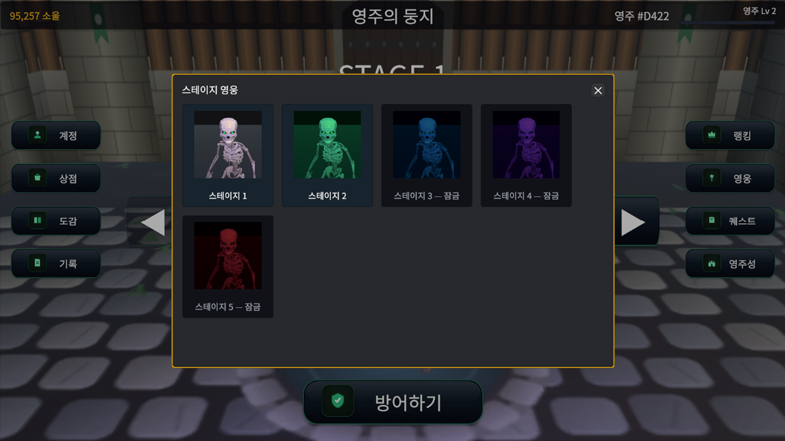

### 2-3. 상점 — 스탯 강화 + 6종족 몬스터 강화

> **게임:** 상점은 두 갈래 강화를 **탭 없이 한 스크롤**에서 섹션 헤더로 나눠 보여줍니다 — 전역 **스탯 강화**(예: 모든 스포너 주기 단축)와 **몬스터 강화**(6종족을 각각 만렙 5까지). 종족을 키우면 그 종이 전장에서 실제로 더 강해지고, 강화 레벨이 발광으로 드러납니다.

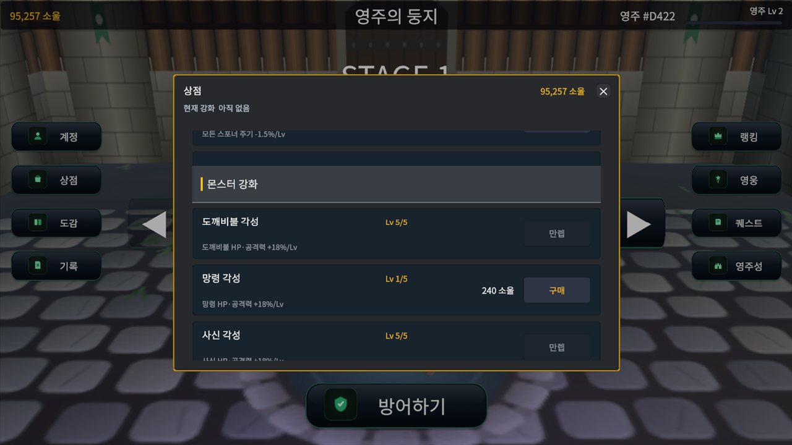

### 2-4. 도감 · 기록 · 영주 레벨 — 성장이 눈에 보이게

> **게임:** 키운 것이 **눈에 보여야** 다시 키우고 싶어집니다. 도감은 몬스터 6종을 실제 프리팹 렌더로 보여주고 **강화 레벨을 발광·확대·「Lv N」 배지**로 드러냅니다(전장·인게임 상태 셀과 같은 표현). 기록은 스테이지별 승리 수·승률·최단 클리어를 모으고, 영주 레벨은 소울 보상 트랙으로 장기 목표를 줍니다.

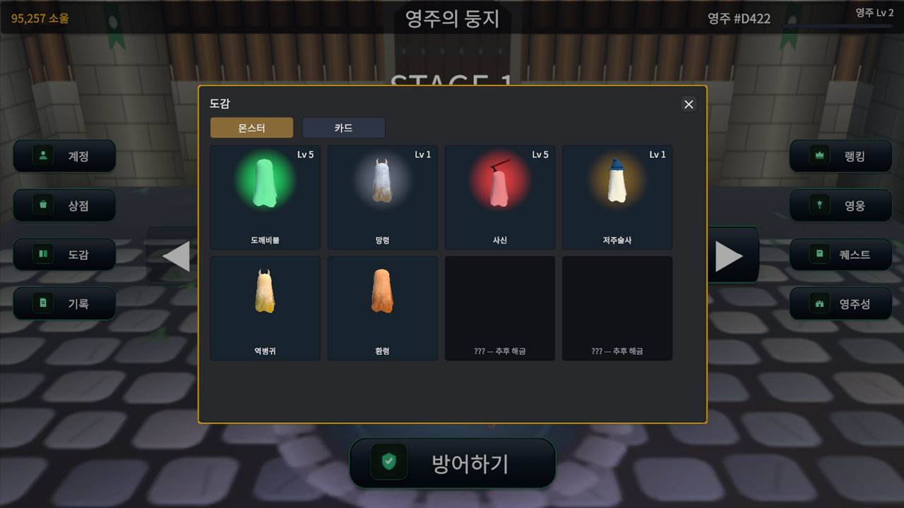

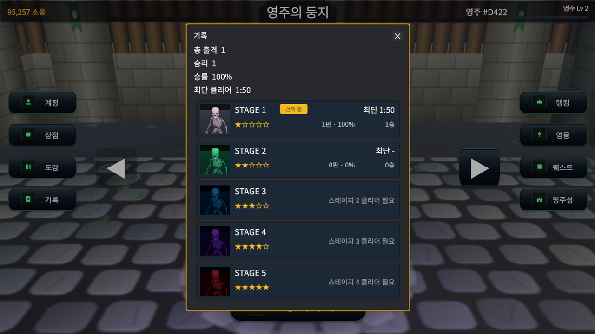

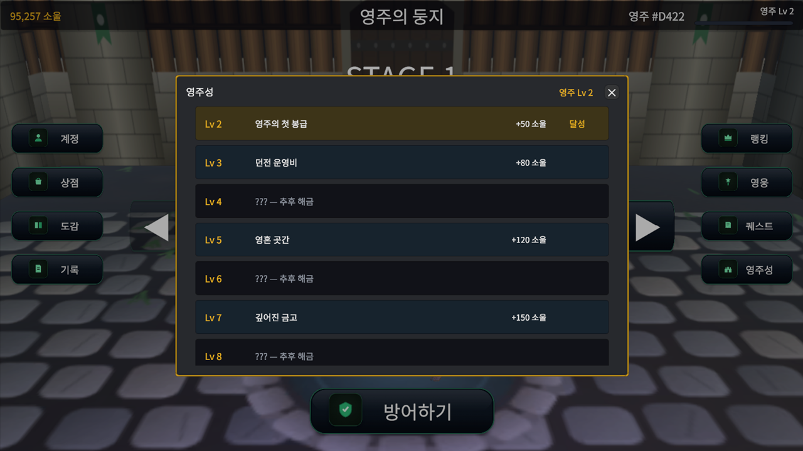

<details>
<summary>구조 — 어떻게 구성했나</summary>

- **로컬 세이브(MetaProfile)** — 소울·강화 레벨·스테이지 진행·기록·도전과제·영주 레벨을 하나의 프로필로 묶어 `persistentDataPath` 의 JSON 으로 저장합니다. (프로필을 단일 단위로 다루도록 설계해, 이후 클라우드 동기를 얹기 쉬운 구조입니다.)
- **강화 시각 = 공유 SoT** — "레벨 → 발광 알파·틴트·스케일·배지" 매핑을 `EnhanceLevelVisual` 한 곳에 두고 **도감·인게임 하단 상태 셀·전장 몬스터**가 같은 코드를 호출합니다. 한 화면에서 값을 바꾸면 세 곳이 함께 움직여 표현이 영원히 어긋나지 않습니다(drift 방지).
- **스테이지 재스킨** — 스켈레톤 영웅 1종을 스테이지 색으로 재스킨해 5스테이지 정체성을 만듭니다. 신규 캐릭터 리소스 제작 없이 콘텐츠 폭을 내는, 현 단계 범위 제약 안의 선택입니다.
- **메타 UI 도 MVVM · 풀링 스크롤뷰** — 상점 품목·도감 셀·기록 셀·영주 보상 행은 모두 공용 풀링 스크롤뷰 패턴(컨테이너 + 스크롤뷰 + 셀 3분할)으로, 코드 동적 생성 없이 셀을 재사용합니다.
- **에디터 지원** — 마을 메타 콘텐츠(상점 품목·도전과제·영주 보상)는 **Meta Editor**(§7)에서 즉시 검증·가격 미리보기와 함께 편집합니다.

</details>

---

## 3. 🃏 카드 & 덱빌딩 — 데이터 주도 설계의 핵심

### 3-1. 카드 = 데이터, 효과 = 전략(Strategy)

> **게임:** 28장의 카드가 전부 다른 일을 합니다 — 종 강화, 스폰 증설, 융합, 용사 저주, 몬스터 버프. 새 카드를 추가하거나 수치를 바꾸는 일이 *기획 작업*이지 *엔진 수정*이 아니어야 했습니다.

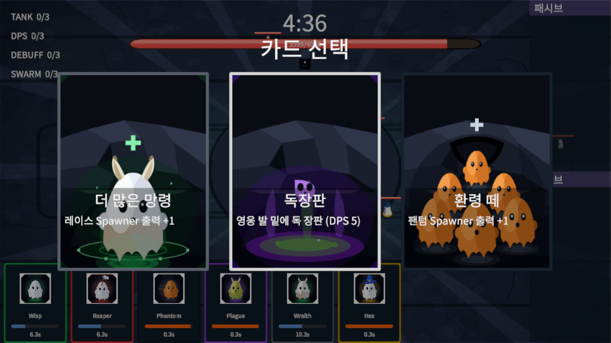

> **구조:** 그래서 카드 효과를 거대한 `switch` 문이 아니라 **한 동작 = 한 전략 클래스**로 분리하고, 카드 데이터에 효과를 다형 직렬화로 담았습니다. 효과는 `IBattleContext` 라는 **전투 seam 하나만** 통해 개입하므로, 효과 클래스는 전투 본체의 구체 타입을 전혀 모릅니다. 이 덕분에 (1) 카드가 엔진 코드와 분리되고 (2) 가짜 컨텍스트로 "이 카드가 무엇을 호출했는가"를 Unity 없이 단위 테스트할 수 있습니다.

```csharp
//# 카드 효과 한 장 — 전투 seam 한 줄만 호출하고, BattleController 의 존재를 모른다
[Serializable]
public class WispHpBoostEffect : ICardEffect
{
    [SerializeField] private float _hpMul = 1.5f;          //# 데이터로 노출 → 코드 수정 없이 튜닝

    public void Apply(IBattleContext ctx)
        => ctx.RegisterMonsterTypeBuff(EMonster.Wisp, EMonsterStatKind.Hp, _hpMul);
}
```

<details>
<summary>구조 — 더 보기</summary>

- 카드 한 장은 ScriptableObject 1개 = { 식별자, 빌드 축, 이름/설명, 아이콘, **효과 전략** }. 효과는 강화·스폰·버프·저주별로 한 파일씩 작게 나뉩니다.
- 전투 seam(`IBattleContext`)이 노출하는 동사는 게임 용어 그대로입니다 — "종 강화", "스폰 출력 +1", "출력 종 변경", "몬스터 소환", "영웅에 오라 부착" 등. 카드는 이 동사들만 조합합니다.
- 용사에게 붙는 저주(공포·출혈·둔화·독…)는 영웅에 부착되는 별도 오라로 구현되어, 매 프레임 진행되고 HP 바 아래 상태 아이콘으로 표시됩니다.

</details>

### 3-2. 4축 × 2-Layer 빌드 시너지 — 매 판 다른 빌드

> **게임:** 카드를 무작위로 줍는 게 아니라 **방향**을 만들고 싶었습니다. 모든 카드는 4개 빌드 축(탱커/딜러/디버프/스웜) 중 하나에 속하고, 같은 축을 **3·5·7장** 모으면 그때마다 강력한 시너지가 한 번씩 터집니다. "이번 판은 스웜으로 밀어볼까" 같은 목표가 생깁니다.

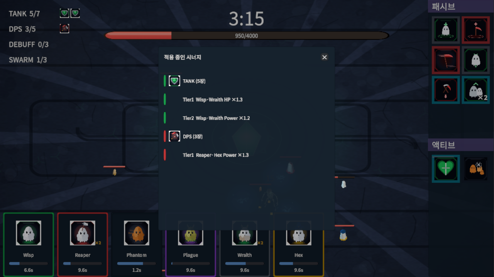

<details>
<summary>구조 — 어떻게 구성했나</summary>

- 시너지 자체도 데이터처럼 다뤘습니다 — 12개 Tier(4축 × 3단계)가 각각 작은 효과 객체이고, 부팅 때 "(축, 임계) → Tier" 로 등록됩니다. 픽이 임계에 정확히 도달한 순간 1회만 발화합니다.
- 카드 효과 적용과 시너지 카운트 증가가 **한 진입점**에서 함께 일어나, "픽 → (본 효과 + 시너지 체크)" 가 항상 같은 순서로 보장됩니다.
- 빌드 카운트는 카드 픽 팝업 상단 바로 노출돼, 플레이어가 시너지까지 몇 장 남았는지 보면서 고릅니다.

| 축 | 3장 | 5장 | 7장 |
|---|---|---|---|
| **탱커** | 핵심 종 HP ↑ | 공격력 ↑ | 필드 몬스터 상한 ↑ |
| **딜러** | 공격력 ↑ | 공속 ↑ | 사거리 ↑ |
| **디버프** | 강한 둔화 | 용사 공격력 영구 ↓ | 영구 출혈 |
| **스웜** | 이동속도 ↑ | 전 스포너 주기 ↓ | 전 스포너 출력 ↑ |

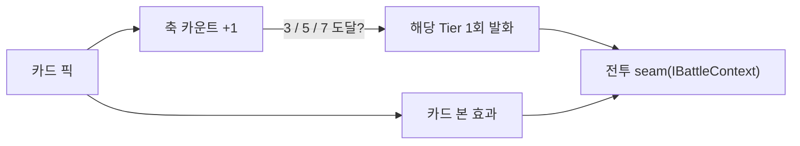
```mermaid
flowchart LR
    Pick["카드 픽"] --> Reg["축 카운트 +1"]
    Reg -->|"3 / 5 / 7 도달?"| Fire["해당 Tier 1회 발화"]
    Pick --> Eff["카드 본 효과"]
    Fire & Eff --> Ctx["전투 seam(IBattleContext)"]
```

</details>

### 3-3. 28장 — 4개의 플레이 정체성

> **게임:** 각 축은 단순한 분류가 아니라 **다른 승리 방식**입니다. 같은 5분이라도 어떤 축을 키웠느냐에 따라 던전이 전혀 다르게 굴러갑니다.

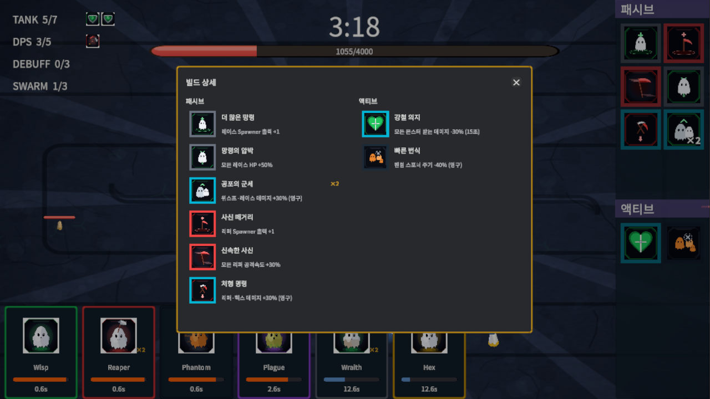

<details>
<summary>4축 콘셉트</summary>

- **탱커** — "용사를 묶어 둔다." 맷집과 진로 방해로 시간을 벌어 다른 축이 일하게 함.
- **딜러** — "빠르게 깎는다." 공속·사거리·치명으로 정면 화력.
- **디버프** — "갉아내고 무력화한다." 둔화·출혈·공포·약화·독으로 용사를 서서히 무너뜨림.
- **스웜** — "머릿수로 압도한다." 스폰 수·이동속도·주기 가속으로 화면을 채워 익사시킴.

> 카드 라인업·수치의 단일 진실은 `docs/design/card-renewal.md`.

</details>

---

## 4. ⚔️ 용사 스킬 — 죽어가며 강해지는 보스

> **게임:** 용사는 그냥 맞고 죽는 샌드백이 아닙니다. HP 가 85/65/45% 를 지날 때마다 **돌진 강타 → 광역 노바 → 궤도 블레이드**를 차례로 해금하며, 몰려든 몬스터를 쓸어담습니다. 던전이 우세할수록 용사의 발악도 거세져, 막판이 데스스파이럴이 아니라 *클라이맥스*가 되도록 의도했습니다.

> **연출:** 스킬 해금 순간을 플레이어가 놓치지 않도록, **격겜식 컷인**을 넣었습니다 — 시간을 멈추고 카메라를 짧게 흔든 뒤 "영웅의 '○○' 스킬 해제" 배너가 좌→중→우로 지나갑니다. 정지 동안 게임 타이머도 함께 멈춰 **5분 예산을 한 톨도 쓰지 않으며**, 카드 선택 팝업과 화면에서 겹치지 않도록 배너를 하단 자막 영역에 배치했습니다. ("다음 카드픽으로 무엇을 견제할지" 판단의 신호)

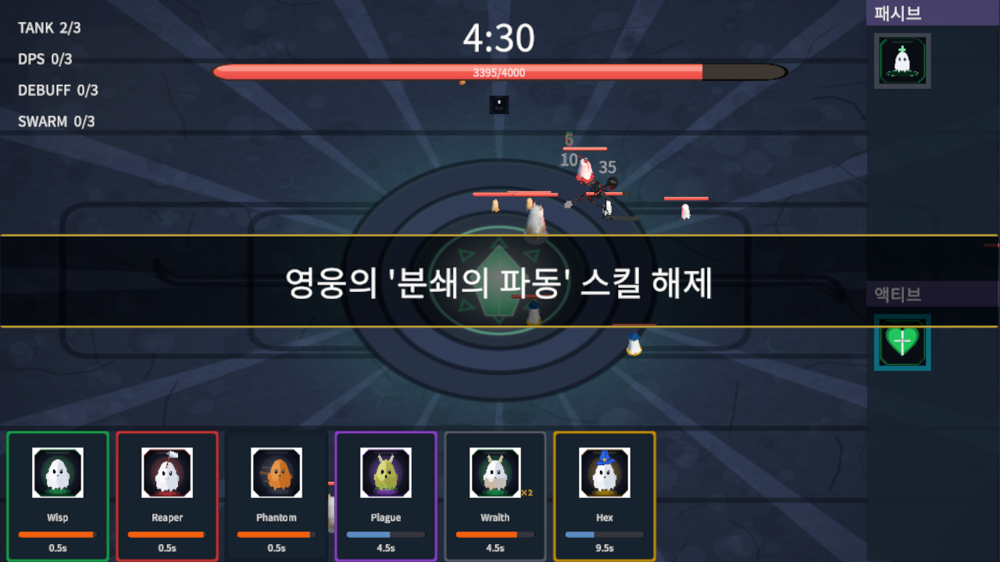

> **구조:** 스킬은 "언제·어떤 모양으로 때릴지"만 정하고, 실제 데미지 적용은 `IHeroSkillContext`(스킬 seam)에 맡깁니다. 그래서 부채꼴(돌진)·링(노바)·공전하는 구(궤도 블레이드) 같은 판정 기하를 시각 효과 없이 단위 테스트로 검증할 수 있습니다.

<details>
<summary>구조 — 어떻게 구성했나</summary>

- HP 비율 게이트가 페이즈를 하나씩 열고(이전 페이즈 유지), 열린 스킬들이 매 프레임 자기 쿨다운을 돌리며 발동합니다.
- 스킬이 호출하는 건 게임 동사뿐입니다 — "부채꼴 범위 데미지(돌진)", "링 범위 데미지 + 넉백(노바)", "공전하는 구 N개 합집합 지속 데미지 + 넉백(궤도 블레이드)", "몬스터 무리 무게중심 구하기(돌진 방향)".
- 실제 구현은 살아있는 몬스터를 순회해 판정하고, 테스트는 가짜 컨텍스트가 호출 파라미터를 기록 — "이 스킬이 반경 R 안 N마리를 때렸다"를 직접 단정합니다.
- **해금 컷인은 별도 컨트롤러로 분리** — 스킬 러너가 해금 순간 이벤트(`OnSkillUnlocked`)를 쏘면, 컷인 컨트롤러가 전투와 **같은 일시정지를 공유**해 시간을 멈추고 카메라 쉐이크·배너를 unscaled 타임으로 순차 구동한 뒤 한 번에 재개합니다. 전투 로직과 연출이 서로를 모릅니다.

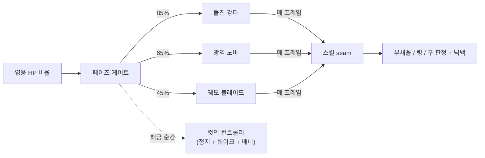
```mermaid
flowchart LR
    HP["영웅 HP 비율"] --> Gate["페이즈 게이트"]
    Gate -->|"85%"| P1["돌진 강타"]
    Gate -->|"65%"| P2["광역 노바"]
    Gate -->|"45%"| P3["궤도 블레이드"]
    P1 & P2 & P3 -->|"매 프레임"| Ctx["스킬 seam"]
    Ctx --> Dmg["부채꼴 / 링 / 구 판정 + 넉백"]
    Gate -.->|"해금 순간"| Cut["컷인 컨트롤러<br/>(정지 + 쉐이크 + 배너)"]
```

</details>

---

## 5. 🤖 자동전투 & 연출

> **게임:** 영웅도 몬스터도 플레이어 조작 없이 가장 가까운 적에게 다가가 싸웁니다. 플레이어의 입력은 오직 카드 선택뿐 — 전투의 결과는 *어떤 빌드를 쌓았는가*로 결정됩니다. 타격 이펙트·데미지 팝업·히트 플래시에 더해 **배경음악과 평타·페이즈별 스킬 효과음**으로 자동전투에도 손맛을 입혔습니다.

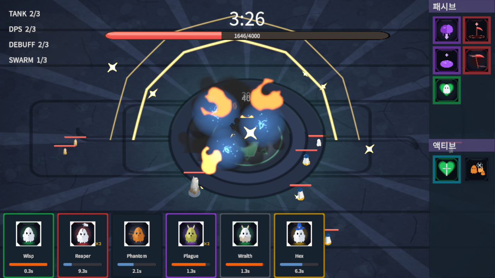

<details>
<summary>구조 — 어떻게 구성했나</summary>

- 살아있는 몬스터 목록을 전역 탐색(`FindObjectsOfType`) 대신 **등록/해제 레지스트리**로 관리합니다. 타겟 탐색·소급 강화·종료 시 생존 집계가 모두 이 한 목록을 공유합니다.
- 모든 런타임 스폰은 풀링을 거치고(직접 생성 금지), 진입 시점에 영웅·몬스터·이펙트를 미리 풀에 비축해 첫 스폰 끊김을 없앱니다.
- 풀 객체는 켜질 때마다 이전 상태를 리셋해, 재사용 시 직전 판의 버프·오라가 새어 들어오지 않게 합니다.
- **사운드는 씬 전환에도 살아남는 영속 볼륨 컨트롤러**가 마스터/BGM/효과음 + 평타·스킬 채널별 볼륨을 들고, 인스펙터 값을 실시간으로 믹서(`CHMSound`)에 반영합니다. 전투 진입 시 BGM 이 루프로 깔리고, 평타·페이즈별 스킬·타격에 각각 효과음이 매핑됩니다.

</details>

---

## 6. 🖥️ UI — MVVM 단방향

> **게임:** 타이머, 용사 HP, 4축 빌드 카운터, 스포너 상태, 카드 팝업, 빌드 상세 모달 — 정보량이 많은 화면을 전투 로직과 깔끔히 분리해야 했습니다.

<!-- TODO: 이미지 자리 —  (파일 추가 후 이 줄 주석 해제) -->

> **구조:** 전투 상태(Model) → 가공(ViewModel) → 표시(View) 한 방향으로 흐릅니다. ViewModel 은 화면을 전혀 모르고 이벤트로만 통지하므로, 화면을 바꿔도 전투가 흔들리지 않고 ViewModel 을 독립 테스트할 수 있습니다.

<details>
<summary>구조 — 어떻게 구성했나</summary>

- ViewModel 이 타이머·HP·빌드 누적·스포너 스냅샷을 이벤트로 push 하고, 각 View 가 구독해 자신만 갱신합니다.
- 카드 리스트·빌드 아이콘·시너지 셀은 공용 풀링 스크롤뷰 패턴(컨테이너 + 스크롤뷰 + 셀 3분할)을 따라, 셀을 재사용하며 코드로 동적 생성하지 않습니다.
- 각 View 위젯은 내부 UI 요소를 숨기고 "무엇을 보여줄지" 의도 단위 API 만 노출합니다 — 외부가 내부 텍스트/이미지를 직접 만지지 않아 화면 구조 변경이 호출부로 새지 않습니다.
- **화면을 16:9 로 고정(레터박스/필러박스)** 합니다. 모든 UI 가 1280×720 단일 좌표계를 전제하므로, 디바이스 종횡비와 무관하게 게임/UI 카메라를 16:9 박스에 가둬 모바일 세로 화면에서도 팝업·배너가 박스 밖으로 새지 않게 막습니다.

</details>

---

## 7. 🧰 자체 제작 툴체인 & 테스트

> **게임:** 5분 자동전투는 **밸런싱이 전부**입니다. 수치를 빠르게 바꾸고, 빠르게 수백 판 돌려 검증하는 도구가 콘텐츠만큼 중요했습니다.

| Card Editor |
|---|
| 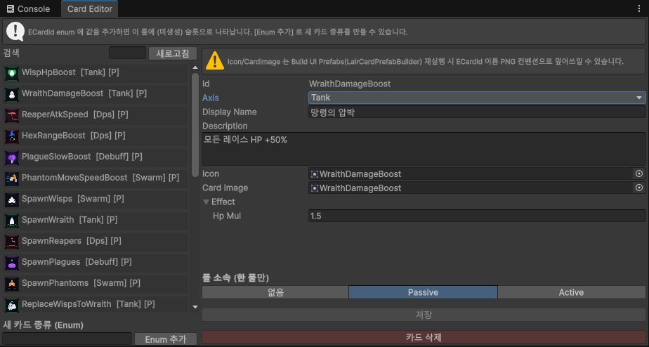 |

| JSON Sync | Balance / 시뮬레이터 |
|---|---|
| 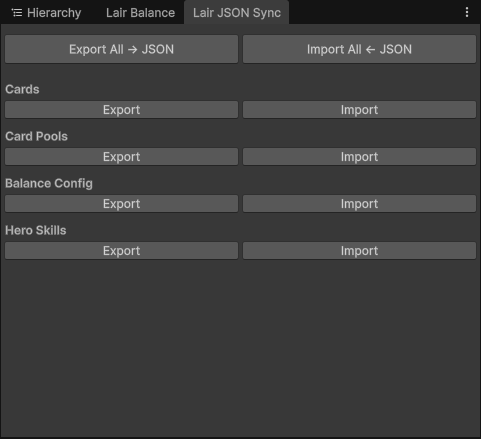 | 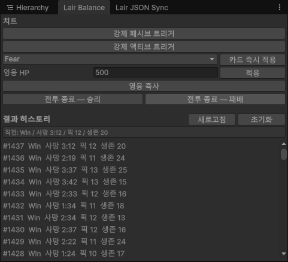 |

| Meta Editor — 상점 품목 | 도전과제 | 영주 보상 |
|---|---|---|
| 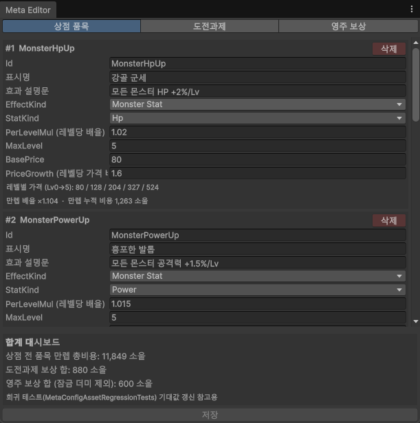 | 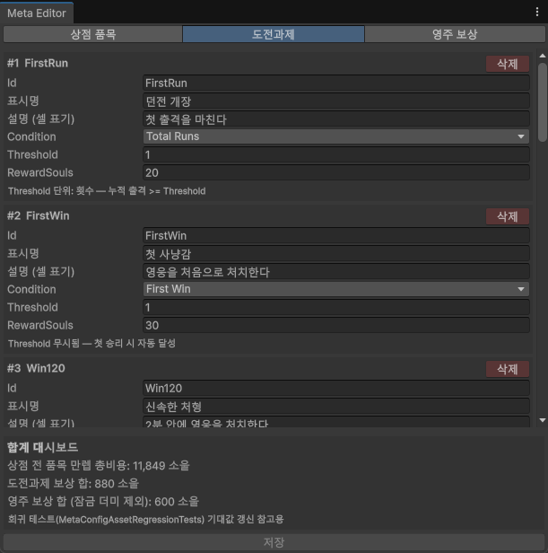 | 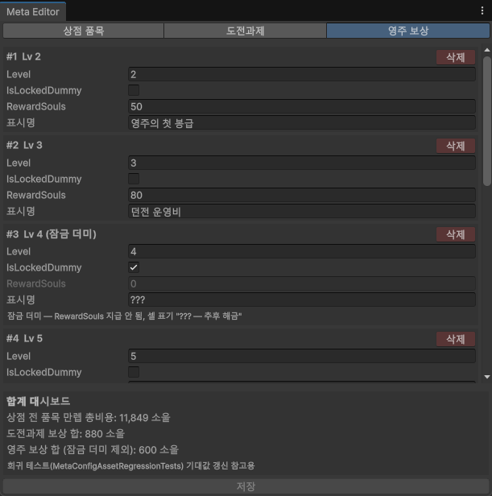 |

<details>
<summary>구조 — 무엇을 만들었나</summary>

- **JSON ↔ 데이터 양방향 동기화** — 카드·카드풀·밸런스·영웅 스킬을 JSON 으로 내보내고 다시 읽어들입니다. 다형 직렬화된 카드 효과까지 JSON 으로 왕복하도록 커스텀 변환기를 붙여, 데이터를 버전 관리 친화적인 텍스트로 다룹니다.
- **헤드리스 밸런스 시뮬레이터** — 카드 팝업을 자동 선택으로 대체해 일시정지 없이 5분 한 판을 빠르게 돌리고, 처치 시간·픽 분포를 수집합니다. "이 빌드가 너무 강한가"를 사람 손 대신 수치로 검증.
- **프리팹 빌더 / 카드 에디터** — 캐릭터·카드·UI·스포너·스킬 프리팹을 코드로 재현 가능하게 생성하고, 카드 정의를 GUI 로 편집하며 식별자 enum 을 코드 생성합니다.
- **메타 에디터 (Meta Editor)** — 마을 메타 콘텐츠(상점 품목·도전과제·영주 보상)를 탭 하나에서 편집합니다. 편집 중 즉시 검증(Id 공백/중복, 도전과제 조건별 단위 안내, 영주 레벨 중복/역순)과 미리보기(런타임 가격 산식을 그대로 재사용한 레벨별 가격표·만렙 배율·누적 비용), 회귀 테스트 기대값 갱신용 합계 대시보드, Undo 를 지원합니다.
- **테스트 우선 코드베이스** — 전투·메타 로직 대부분이 POCO 서비스 + 인터페이스 seam 이라 Unity 런타임 없이 EditMode 로 단위 테스트됩니다(약 1,345개). 프리팹 부착·풀 재사용처럼 런타임이 필요한 것만 PlayMode(약 180개). **테스트 코드가 구현 코드보다 많습니다.**

</details>

---

## 8. 🧱 재사용 가능한 인프라 패키지 (ChvjPackage)

> **왜:** 리소스 로딩·오브젝트 풀링·UI·사운드처럼 *어떤 게임에든 똑같이 필요한* 기반 기능은 Project Lair 코드 안에 두지 않고, **도메인을 모르는 별도 Unity 패키지 `com.chvj.unityinfra`** 로 떼어냈습니다. 게임은 이 패키지를 가져다 쓰기만 하고, 패키지는 게임을 전혀 모릅니다 — 그래서 다음 프로젝트에 폴더째 들고 가 재사용할 수 있는 토대가 됩니다.

> **구조:** 의존은 언제나 `게임 코드 → 인프라 패키지 → Unity` **한 방향**입니다. 패키지가 게임 타입을 역참조하지 않으므로, 게임을 바꿔도 인프라는 그대로고 인프라를 다른 게임에 꽂아도 동작합니다. 게임 코드는 풀링·리소스 로딩 같은 공통 기능을 **다시 구현하지 않고** 패키지 API 만 호출합니다.

<details>
<summary>무엇을 제공하나 — 게임이 실제로 쓰는 모듈</summary>

| 모듈 | 게임에서 하는 일 |
|---|---|
| **Resource** | Addressables 를 enum 키로 감싼 비동기 로더(`CHMResource`) — 문자열 키 하드코딩 없이 *"enum 값 = 에셋 파일명"* 규약으로 영웅·몬스터·이펙트 프리팹을 로드 |
| **Pool** | 런타임 스폰이 전부 거치는 오브젝트 풀(`CHMPool`) — 직접 생성/파괴 없이 영웅·몬스터·이펙트·발사체를 재사용, 첫 스폰 끊김 제거 |
| **UI** | UI 표시·스택 관리(`CHMUI`) + UGUI 래퍼(`CHText`/`CHButton`/`CHToggle`) + 풀링 스크롤뷰(`CHPoolingScrollView`) |
| **Audio** | 마스터·BGM·효과음 채널을 묶은 사운드 믹서(`CHMSound`) — 전투 BGM·평타·스킬 효과음이 이 위에 매핑 |

- 게임 코드는 위 API 만 호출하고, 같은 기능을 게임 쪽에 중복 구현하지 않습니다.
- 패키지에 없는 공통 기능이 필요하면 **게임이 아니라 패키지에 추가**한 뒤 사용 — 그래야 일회성 코드가 아니라 재사용 자산으로 남습니다.

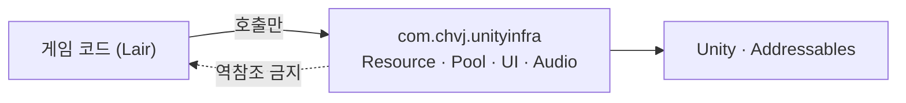
```mermaid
graph LR
    Game["게임 코드 (Lair)"] -->|"호출만"| Infra["com.chvj.unityinfra<br/>Resource · Pool · UI · Audio"]
    Infra --> Unity["Unity · Addressables"]
    Infra -.->|"역참조 금지"| Game
```

</details>

---

# 📎 부록

## A. 실행 방법

**Prerequisites:** Unity **6000.0.68f1** (URP 17.0.4) · Addressables

1. Unity Hub 에서 프로젝트 루트를 엽니다.
2. Addressables 가 빌드되어 있지 않으면 `Window > Asset Management > Addressables > Groups` 에서 Build (영웅·몬스터 프리팹 로드에 필요).
3. `Assets/_Lair/Scenes/Loading.unity` (진입점, index 0) 를 열고 Play — 로딩이 끝나면 **마을 허브 `Village`**(시작 화면 겸임, 별도 메인 메뉴 없음)로 넘어가고, 마을에서 스테이지를 골라 **방어하기**로 출격하면 `Battle` 이 시작됩니다. 승리/패배 후 다시 마을로 복귀합니다. (`Village`·`Battle` 을 직접 열어 Play 하면 로딩 단계 초기화를 건너뛰므로 반드시 `Loading` 에서 시작.)
4. (선택) `Lair` 메뉴의 JSON Sync · Card Editor · Balance Window 로 데이터·시뮬레이션 도구 사용.

## B. 기술 스택 & 의존 방향

- **엔진**: Unity 6 (6000.0.68f1) / URP 17.0.4 · **언어**: C#
- **빌드 타깃**: PC + Android(APK) — 화면은 종횡비와 무관하게 16:9 레터박스로 고정
- **아키텍처**: MVVM + 데이터 주도(ScriptableObject) + 인터페이스 seam · **에셋 로딩**: Addressables
- **인프라 패키지**: 자체 제작 공용 패키지 `com.chvj.unityinfra`(리소스·풀·UI) — 게임 코드가 일방향으로 의존
- **테스트**: Unity Test Framework (NUnit) — EditMode / PlayMode

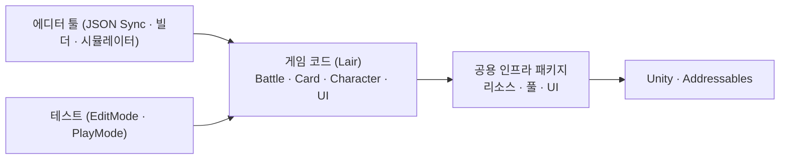
```mermaid
graph LR
    Game["게임 코드 (Lair)<br/>Battle · Card · Character · UI"] --> Infra["공용 인프라 패키지<br/>리소스 · 풀 · UI"]
    Infra --> Unity["Unity · Addressables"]
    Tools["에디터 툴 (JSON Sync · 빌더 · 시뮬레이터)"] --> Game
    Tests["테스트 (EditMode · PlayMode)"] --> Game
```

## C. 폴더 구조

```
Assets/_Lair/
├── Scripts/                    런타임 게임 코드
│   ├── Battle/                 오케스트레이터 · 생산기 · 트리거/큐/일시정지 서비스
│   ├── Card/                   카드 데이터 · 덱 · 효과(전략) · 4축 시너지 Tier
│   ├── Character/              체력 · 자동전투 AI · 영웅 스킬(페이즈 게이트)
│   ├── Meta/                   MetaProfile 세이브 · 소울 · 강화/영주 레벨 · 도전과제 · 기록
│   ├── Village/                마을 허브 진입/흐름
│   ├── Data/                   공용 Enum · 밸런스 설정
│   └── UI/                     ViewModel · HUD · 빌드/시너지 패널 + 마을/상점/도감/기록 (MVVM)
├── Editor/                     프리팹 빌더 · JSON Sync · 밸런스 시뮬레이터 · Meta Editor
├── Tests/                      EditMode(약 1,345) · PlayMode(약 180)
├── Art/                        Addressable 에셋 (캐릭터 · FX · UI · 카드 · 스킬 · 사운드 · 스프라이트)
├── Data/                       폰트 · JSON · 밸런스 설정 에셋
└── Scenes/                     Loading.unity (index 0) · Village.unity (마을 허브) · Battle.unity

docs/design/                    컨셉 기획서 + 기능별 기획서 (카드 · 영웅 스킬 · 지속 스폰 · 마을 메타)
```

---

> 본 README 는 **v0.3(클라우드 계정·세이브·랭킹)** 단계 기준입니다. MVP(5분 코어 루프) → v0.2(마을 허브) → v0.3 순으로 앞 가설을 검증한 뒤에만 다음 범위를 열었습니다. 구글 로그인·계정 연동, 신규 영웅·몬스터·카드 *리소스* 제작은 다음 단계로 미뤄둔 의도적 범위 제한이며, 콘텐츠 수치의 단일 진실은 `docs/design/` 기획서에 있습니다.
